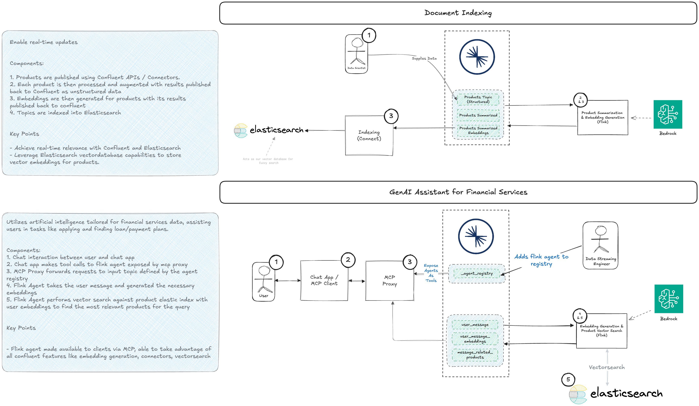

# Flink-Based Loan Product Search Agent

[Back to Main README](../../README.md)

## Overview

This tutorial demonstrates how to create a real-time loan product search agent using Confluent Flink and expose it as a
tool through the MCP/OpenAPI Proxy. The agent processes user queries, finds the most relevant loan products using vector
search, and returns the results in real-time.


## Architecture

The agent works in the following way:

1. User sends a query about loan products
2. Query is converted to embeddings using Amazon Bedrock
3. Vector search finds the most relevant products in Elasticsearch
4. Results are returned through MCP/OpenAPI Proxy



## Prerequisites

Before starting, ensure you have:

1. A Confluent Cloud account with Flink enabled
2. The Confluent CLI installed and configured
3. An Elasticsearch cluster set up and accessible, with api key/secrets and an account with appropriate permissions
4. AWS credentials for accessing Bedrock services

## Step-by-Step Guide

### 1. Set Up Flink Connections

First, create the necessary Flink connections to external services:

```shell
# Create Bedrock connection for embeddings
confluent flink connection create bedrock-titan-embed-connection \
  --cloud GCP \
  --region us-east4 \
  --environment env-03gdd9 \
  --type bedrock \
  --endpoint https://bedrock-runtime.us-east-1.amazonaws.com/model/amazon.titan-embed-text-v1/invoke \
  --aws-access-key $AWS_ACCESS_KEY_ID \
  --aws-secret-key $AWS_SECRET_ACCESS_KEY \
  --aws-session-token $AWS_SESSION_TOKEN

# Create Bedrock connection for Claude
confluent flink connection create bedrock-claude-35-connection \
  --cloud GCP \
  --region us-east4 \
  --environment env-03gdd9 \
  --type bedrock \
  --endpoint https://bedrock-runtime.us-east-1.amazonaws.com/model/anthropic.claude-3-5-sonnet-20240620-v1:0/invoke \
  --aws-access-key $AWS_ACCESS_KEY_ID \
  --aws-secret-key $AWS_SECRET_ACCESS_KEY \
  --aws-session-token $AWS_SESSION_TOKEN

# Create Elasticsearch connection
confluent flink connection create elastic-connection \
  --cloud GCP \
  --region us-east4 \
  --type elastic \
  --endpoint ${ELASTICSEARCH_ENDPOINT} \
  --api-key ${ELASTIC_API_KEY}
```

### 2. Create Bedrock Models

Set up the models for text generation and embeddings:

```sql
-- General text generation model
CREATE
MODEL BedrockGeneralModel
INPUT (text STRING)
OUTPUT (response STRING)
COMMENT 'General model with no system prompt.'
WITH (
    'task' = 'text_generation',
    'provider' = 'bedrock',
    'bedrock.PARAMS.max_tokens' = '200000',
    'bedrock.PARAMS.temperature' = '0.1',
    'bedrock.connection' = 'bedrock-claude-35-connection',
    'bedrock.client_timeout' = '120',
    'bedrock.system_prompt' = ''
);

-- Embedding model
CREATE
MODEL BedrockTitanEmbed
INPUT (text STRING)
OUTPUT (embeddings ARRAY<FLOAT>)
WITH (
    'bedrock.connection' = 'bedrock-titan-embed-connection',
    'task' = 'embedding',
    'provider' = 'bedrock'
);
```

### 3. Set Up Elasticsearch

Create an Elasticsearch index with proper vector search capabilities:

```json
PUT /products_summarized_with_embeddings/_mapping
{
  "properties": {
    "embeddings": {
      "type": "dense_vector",
      "dims": 1536,
      "index": true,
      "similarity": "cosine",
      "index_options": {
        "type": "int8_hnsw",
        "m": 16,
        "ef_construction": 100
      }
    },
    "product_id": {
      "type": "text"
    },
    "summary": {
      "type": "text"
    },
    "description": {
      "type": "text"
    },
    "name": {
      "type": "text"
    },
    "type": {
      "type": "text"
    },
    "currency": {
      "type": "text"
    },
    "term_min_length": {
      "type": "text"
    },
    "term_max_length": {
      "type": "text"
    },
    "repayment_frequency": {
      "type": "text"
    },
    "risk_level": {
      "type": "text"
    },
    "status": {
      "type": "text"
    },
    "rate_table": {
      "type": "text"
    },
    "createdAt": {
      "type": "text"
    },
    "updatedAt": {
      "type": "text"
    },
    "ref_link": {
      "type": "text"
    }
  }
}
```

### 4. Create Flink Tables

Create the necessary tables for the data pipeline:

```sql
-- Table for raw product data
CREATE TABLE products
(
    product_id          STRING PRIMARY KEY NOT ENFORCED,
    description         STRING,
    type                STRING,
    name                STRING,
    currency            STRING,
    term_min_length     STRING,
    term_max_length     STRING,
    repayment_frequency STRING,
    risk_level          STRING,
    status              STRING,
    rate_table          STRING,
    createdAt           STRING,
    updatedAt           STRING,
    ref_link            STRING
) WITH (
      'changelog.mode' = 'append',
      'kafka.cleanup-policy' = 'compact',
      'value.fields-include' = 'all',
      'key.format' = 'json-registry',
      'value.format' = 'json-registry'
      );

-- Table for summarized products
CREATE TABLE products_summarized
(
    product_id          STRING PRIMARY KEY NOT ENFORCED,
    summary             STRING,
    description         STRING,
    type                STRING,
    name                STRING,
    currency            STRING,
    term_min_length     STRING,
    term_max_length     STRING,
    repayment_frequency STRING,
    risk_level          STRING,
    status              STRING,
    rate_table          STRING,
    createdAt           STRING,
    updatedAt           STRING,
    ref_link            STRING
) WITH (
      'changelog.mode' = 'append',
      'kafka.cleanup-policy' = 'compact',
      'value.fields-include' = 'all',
      'key.format' = 'json-registry',
      'value.format' = 'json-registry'
      );

-- Table for products with embeddings
CREATE TABLE products_summarized_with_embeddings
(
    product_id          STRING PRIMARY KEY NOT ENFORCED,
    summary             STRING,
    description         STRING,
    type                STRING,
    name                STRING,
    currency            STRING,
    term_min_length     STRING,
    term_max_length     STRING,
    repayment_frequency STRING,
    risk_level          STRING,
    status              STRING,
    rate_table          STRING,
    createdAt           STRING,
    updatedAt           STRING,
    ref_link            STRING,
    embeddings          ARRAY<FLOAT>
) WITH (
      'changelog.mode' = 'append',
      'kafka.cleanup-policy' = 'compact',
      'value.fields-include' = 'all',
      'key.format' = 'json-registry',
      'value.format' = 'json-registry'
      );

-- Tables for handling user queries
CREATE TABLE user_message
(
    correlationId STRING PRIMARY KEY NOT ENFORCED,
    message       STRING
) WITH (
      'changelog.mode' = 'append',
      'kafka.cleanup-policy' = 'compact',
      'value.fields-include' = 'except-key',
      'key.format' = 'json-registry',
      'value.format' = 'json-registry'
      );

CREATE TABLE user_message_embeddings
(
    correlationId STRING PRIMARY KEY NOT ENFORCED,
    message       STRING,
    embeddings    ARRAY<FLOAT>
) WITH (
      'changelog.mode' = 'append',
      'kafka.cleanup-policy' = 'compact',
      'value.fields-include' = 'except-key',
      'key.format' = 'json-registry',
      'value.format' = 'json-registry'
      );

CREATE TABLE user_message_related_products
(
    correlationId   STRING PRIMARY KEY NOT ENFORCED,
    relatedProducts ROW<id STRING,
    description     STRING> ARRAY
) WITH (
      'changelog.mode' = 'append',
      'kafka.cleanup-policy' = 'compact',
      'value.fields-include' = 'except-key',
      'key.format' = 'json-registry',
      'value.format' = 'json-registry'
      );
```

### 5. Create the Processing Pipeline

Set up the data processing flow:

```sql
-- Generate embeddings for user messages
INSERT INTO user_message_embeddings
SELECT correlationId,
       message,
       embeddings
FROM user_message,
     LATERAL TABLE (ML_PREDICT ('BedrockTitanEmbed', message));

-- Find related products using vector search
INSERT INTO user_message_related_products
SELECT correlationId,
       search_results as relatedProducts
FROM user_message_embeddings,
     LATERAL TABLE(VECTOR_SEARCH(elastic, 3, embeddings));
```

### 6. Register the Agent with MCP/OpenAPI Proxy

Finally, register the agent to make it available through the MCP/OpenAPI Proxy:

```sql
INSERT INTO _agent_registry
VALUES ('LoanProductSearchAgent',
        'This agent searches the most relevant loan products based on the clients request',
        'user_message',
        'user_message_related_products',
        'correlationId',
        'tool',
        '',
        '');
```

## Testing the Agent

Once set up, you can test the agent by invoking the `LoanProductSearchAgent` tool with an mcp client against the mcp
proxy server:

1. Sending a message to the `user_message` topic
2. The pipeline will automatically process it and find relevant products
3. Results will be available in the `user_message_related_products` topic
4. The agent can be accessed through the MCP/OpenAPI Proxy interface

## Conclusion

You now have a working loan product search agent that:

- Processes user queries in real-time
- Uses vector search to find relevant products
- Is accessible through the MCP/OpenAPI Proxy
- Can be integrated into other applications

For sample loan data and additional configuration options, refer to the appendix below.

